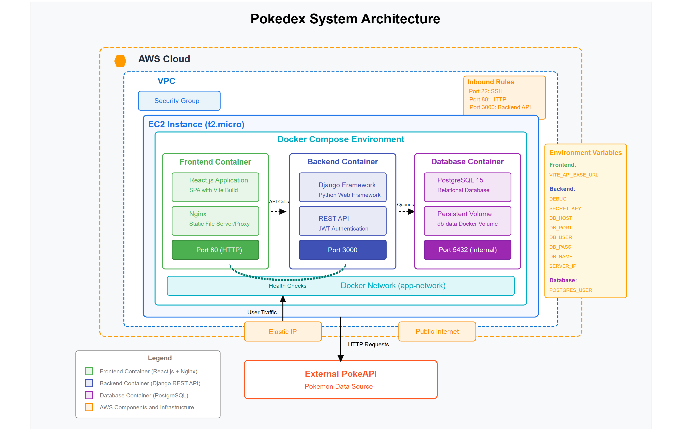
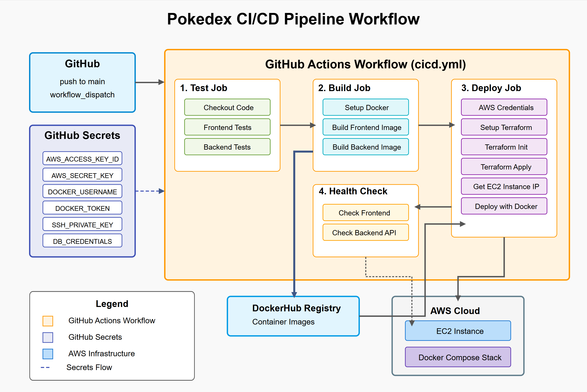

# DevOps Assessment III: Pokédex CI/CD Implementation

This Pokédex application demonstrates a comprehensive implementation of
Continuous Integration and Continuous Deployment (CI/CD) principles utilizing
containerization and automation through GitHub Actions. The project successfully
automates the deployment of a three-tier application stack through a
well-structured CI/CD pipeline. The stack includes a React frontend with Nginx
web server, a Django backend API, and a PostgreSQL database, all containerized
using Docker and orchestrated with Docker Compose.

The pipeline manages secrets and environment variables across multiple
environments, builds and deploys containerized instances of each application
component, and automates the delivery process using GitHub Actions workflows,
resulting in a deployment that requires minimal manual intervention.

<p align="center" style="margin-top: 30px;">
  
</p>

## 🌐 Live Demo

<!-- Visit the live application at: [here](https://d18sty0dsu44el.cloudfront.net/). -->

Visit the live application at: [here](http://52.87.68.42/).

## 🌟 Features

- **Pokémon Browser**: Search and view detailed information about Pokémon using
  data from the PokeAPI
- **User Authentication**: Create accounts and login to maintain personalized
  profiles
- **Team Building**: Create and manage your own Pokémon teams
- **Memory Game**: Test your memory with a Pokémon memory matching game
- **Leaderboards**: Compete for high scores in different difficulty levels

## 🏗️ Architecture

This application follows a three-tier architecture:

- **Frontend**: React.js application served by Nginx
- **Backend**: Django REST API with JWT authentication
- **Database**: PostgreSQL for data persistence

All components are containerized using Docker and orchestrated with Docker
Compose.

### System Architecture Diagram

<p align="center" style="margin-top: 30px;">
  
</p>

## 🚀 CI/CD Pipeline

The project implements a complete CI/CD pipeline using GitHub Actions with four
primary stages:

1. **Test**: Automatically runs frontend and backend tests

   - Frontend: React component and unit tests with Vite
   - Backend: Django unit tests

2. **Build**: Builds Docker images for both frontend and backend

   - Multi-stage builds for optimized images
   - Caching strategies for faster builds
   - Pushes images to Docker Hub registry

3. **Deploy**: Provisions AWS infrastructure using Terraform and deploys the
   application

   - Creates EC2 instance with security groups
   - Sets up networking and SSH access
   - Deploys containerized application stack

4. **Health Check**: Verifies that the application is running correctly
   - Tests frontend and backend endpoints
   - Confirms database connectivity
   - Validates application functionality

### CI/CD Pipeline Workflow

<p align="center" style="margin-top: 30px;">
  
</p>

## 📊 Technical Stack

### Frontend

- **Framework**: React.js with Vite
- **State Management**: React Context API
- **HTTP Client**: Axios for API requests
- **Styling**: CSS with Chakra UI components
- **Web Server**: Nginx for static content serving and API proxying

### Backend

- **Framework**: Django 5.1.6
- **API**: Django REST Framework 3.15.2
- **Authentication**: JWT via SimpleJWT
- **Database ORM**: Django ORM
- **Database**: PostgreSQL

### DevOps

- **Containerization**: Docker & Docker Compose
- **CI/CD**: GitHub Actions
- **Infrastructure as Code**: Terraform
- **Cloud Provider**: AWS (EC2, EIP, Security Groups)
- **Monitoring**: Server logs with CloudWatch integration
- **Security**: Environment variables, AWS IAM, Security Groups

## 🛠️ Local Development Setup

### Prerequisites

- Git
- Docker and Docker Compose
- Node.js (optional, for local frontend development)
- Python 3.11 (optional, for local backend development)

### Getting Started

1. Clone the repository:

   ```bash
   git clone https://github.com/mikhail-w/devops-assessment-3.git
   cd devops-assessment-3
   ```

2. Create a `.env` file in the root directory:

   ```
   # Database Configuration
   DB_USER=admin
   DB_PASS=adminpassword
   DB_NAME=pokedex_db
   DB_HOST=db
   DB_PORT=5432

   # Django Configuration
   DJANGO_SECRET_KEY=your-secret-key
   DEBUG=True

   # Server Configuration
   SERVER_IP=localhost

   # Docker Hub Configuration (for CI/CD)
   DOCKER_HUB_USERNAME=your-dockerhub-username
   ```

3. Start the application:

   ```bash
   docker-compose up -d
   ```

4. Create a superuser for the Django admin:

   ```bash
   docker-compose exec backend python manage.py createsuperuser
   ```

5. Access the application:
   - Frontend: http://localhost
   - Backend API: http://localhost:3000
   - Admin Interface: http://localhost:3000/admin

## 🔧 CI/CD Pipeline In-Depth Documentation

### Secret and Environment Variable Management

The CI/CD pipeline manages secrets and environment variables across multiple
environments:

1. **GitHub Repository Secrets**:

   - AWS credentials (`AWS_ACCESS_KEY_ID`, `AWS_SECRET_ACCESS_KEY`,
     `AWS_REGION`)
   - Docker Hub credentials (`DOCKER_HUB_USERNAME`, `DOCKER_HUB_TOKEN`)
   - SSH key for deployment (`SSH_PRIVATE_KEY`)
   - Application secrets (`DJANGO_SECRET_KEY`, `DB_USER`, `DB_PASS`, `DB_NAME`)

2. **Environment Variable Handling**:

   - CI/CD pipeline environment variables defined in GitHub Actions workflow
   - Docker Compose environment variables passed from CI/CD to containers
   - Application configuration uses environment variables (not hardcoded values)
   - Environment-specific variables set at deployment time

3. **Secure Transmission**:
   - Secrets are never exposed in logs or repositories
   - SSH keys and passwords are stored as GitHub secrets
   - Database credentials are injected at runtime

### Docker Configuration

The containerization strategy uses specialized Dockerfiles for each component:

#### Frontend Dockerfile

The frontend uses a multi-stage build process:

- Build stage uses Node.js to compile the React application
- Production stage uses lightweight Nginx image to serve static assets
- Build artifacts are copied from build stage to production stage
- Custom Nginx configuration for handling SPA routing and API proxying

```dockerfile
# Build stage
FROM node:18-alpine AS build
WORKDIR /app
COPY package*.json ./
RUN npm ci
COPY . ./
RUN npm run build

# Production stage
FROM nginx:alpine
COPY --from=build /app/dist /usr/share/nginx/html
COPY nginx.conf /etc/nginx/conf.d/default.conf
EXPOSE 80
CMD ["nginx", "-g", "daemon off;"]
```

#### Backend Dockerfile

The backend uses a Python image with optimized dependencies:

- Uses slim variant of Python 3.11 for smaller image size
- Installs only necessary system dependencies
- Custom entrypoint script for handling database migrations and startup
- Proper health checks and container configuration

```dockerfile
FROM python:3.11-slim
WORKDIR /app
COPY requirements.txt .
RUN pip install --no-cache-dir -r requirements.txt
COPY . .
COPY entrypoint.sh .
RUN chmod +x /app/entrypoint.sh
CMD ["/app/entrypoint.sh"]
EXPOSE 3000
```

#### Docker Compose Configuration

The Docker Compose file orchestrates all services with proper dependencies:

- Network configuration for service communication
- Volume management for persistent data
- Health checks for ensuring service readiness
- Environment variable passing
- Restart policies for reliability

### GitHub Actions Workflow Configuration

The GitHub Actions workflow (`cicd.yml`) implements the CI/CD pipeline:

```yaml
name: Pokedex CI/CD Pipeline

on:
  push:
    branches: [main]
  workflow_dispatch:

jobs:
  test:
    name: Test Application
    runs-on: ubuntu-latest
    steps:
      # Frontend and backend testing steps...

  build:
    name: Build Docker Images
    runs-on: ubuntu-latest
    needs: test
    steps:
      # Docker build and push steps...

  deploy:
    name: Provision Infrastructure and Deploy
    needs: build
    runs-on: ubuntu-latest
    steps:
      # Terraform and deployment steps...

  health-check:
    name: Health Check
    needs: deploy
    runs-on: ubuntu-latest
    steps:
      # Application health verification steps...
```

Key workflow features:

- Efficient job dependencies and parallel execution
- Conditional execution based on event types
- Proper error handling and recovery
- Caching of dependencies and build artifacts
- Resource cleanup before deployments

### Terraform Infrastructure Configuration

Infrastructure is provisioned using Terraform with the following resources:

- **EC2 Instance**: Ubuntu 22.04 LTS for running the application
- **Security Group**: Configured with necessary ports open (22, 80, 443, 3000)
- **Elastic IP**: For stable addressing of the application
- **Key Pair**: For secure SSH access
- **User Data Script**: Bootstrap script for initial server setup

### Monitoring and Logging

The application includes comprehensive monitoring and logging:

- **Application Logs**: Django and Nginx logs for debugging
- **Container Monitoring**: Docker health checks and status monitoring
- **CI/CD Pipeline Monitoring**: GitHub Actions workflow logs
- **Infrastructure Monitoring**: AWS CloudWatch integration

### Testing Strategy

The CI/CD pipeline includes automated testing:

- **Frontend Tests**: React component and unit tests
- **Backend Tests**: Django unit tests for API endpoints and models
- **Integration Tests**: API endpoint testing with actual database
- **Deployment Tests**: Health checks after deployment

## 📁 Project Structure

```
pokedex-app/
├── .github/
│   └── workflows/
│       └── cicd.yml       # CI/CD pipeline configuration
├── frontend/
│   ├── public/            # Static assets
│   ├── src/               # React components and logic
│   │   ├── services/      # API service clients
│   │   ├── components/    # React components
│   │   ├── hooks/         # Custom React hooks
│   │   └── pages/         # Application pages
│   ├── Dockerfile         # Frontend container configuration
│   └── nginx.conf         # Nginx web server configuration
├── backend/
│   ├── users/             # Django app for user management
│   ├── backend/           # Django project settings
│   ├── manage.py          # Django management script
│   ├── requirements.txt   # Python dependencies
│   ├── entrypoint.sh      # Container entrypoint script
│   └── Dockerfile         # Backend container configuration
├── docker-compose.yml     # Container orchestration
├── main.tf                # Terraform configuration for AWS
└── README.md              # This file
```

## 🧪 Running Tests Locally

### Frontend Tests

```bash
cd frontend
npm test
```

### Backend Tests

```bash
cd backend
python manage.py test
```

## 🔐 Security Considerations

The application implements security best practices:

- JWT authentication for API access
- CORS configuration for frontend-backend communication
- Environment variable usage for sensitive information
- AWS security groups for network isolation
- HTTPS ready configuration
- Database password protection

## 🚨 Troubleshooting

Common issues and solutions:

- **Docker Compose Issues**:

  ```bash
  docker-compose down -v
  docker-compose up -d
  ```

- **Database Connection Errors**:

  ```bash
  docker-compose logs db
  ```

- **Frontend Not Loading**:

  ```bash
  docker-compose logs frontend
  ```

- **Backend API Errors**:
  ```bash
  docker-compose logs backend
  ```

## 📄 API Endpoints

### Authentication

- `POST /api/users/register/`: Register a new user
- `POST /api/users/login/`: Login and receive JWT tokens
- `POST /api/users/logout/`: Logout and invalidate tokens

### User Data

- `GET /api/users/team/`: Get the current user's Pokémon team
- `POST /api/users/update_team/`: Add or remove Pokémon from team
- `POST /api/users/update_high_score/`: Update game high scores
- `GET /api/users/leaderboard/`: Get leaderboard data

### Pokémon Data

- External API calls to PokeAPI for Pokémon information

## 📚 Lessons Learned

Throughout this project, several DevOps best practices were implemented:

1. **Infrastructure as Code**: Using Terraform to manage AWS resources
2. **Containerization**: Using Docker to package applications and dependencies
3. **CI/CD Automation**: Using GitHub Actions for automated testing and
   deployment
4. **Secret Management**: Secure handling of credentials and sensitive
   information
5. **Monitoring and Logging**: Comprehensive logging for troubleshooting
6. **Testing Integration**: Automated tests as part of the deployment pipeline

## 🤝 Contributing

Contributions are welcome! Please feel free to submit a Pull Request.

## 📄 License

This project is licensed under the MIT License.
